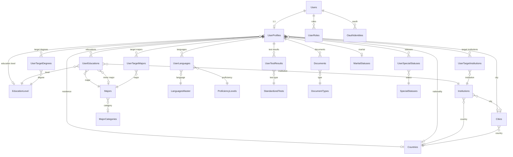
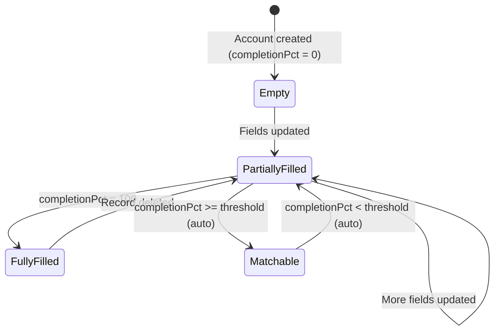
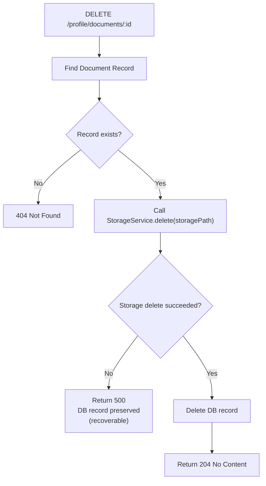

# Data Model: Profile Module v2 Redesign

**Feature**: 005-profile-foundation
**Date**: 2026-09-21
**Schema version**: 2.0 (canonical source: `docx/complete-schema.md`)

---

## Entity Overview

Note: MajorCategories, EducationLevel, MaritalStatuses, SpecialStatuses, StandardizedTests, LanguagesMaster, ProficiencyLevels, and DocumentTypes are fully seeded before Batch 1 tests run. Countries, Cities, Majors, and Institutions are loaded via the reference data loader described in the "Reference Data Loading Strategy" section.

---

## Core Entities

### UserProfiles — Profile Hub

The central table of the profile domain. Primary key is `userId` (same UUID as
`Users.id`) — enforcing strict 1:1 and eliminating a separate surrogate key.

| Column | Type | Nullable | Notes |
|:---|:---|:---:|:---|
| `userId` | UUID PK | No | FK → `Users.id` (cascade delete) |
| `firstName` | VARCHAR(255) | Yes | Profile name — may differ from account name |
| `lastName` | VARCHAR(255) | Yes | |
| `email` | TEXT | Yes | Profile email — may differ from account email |
| `dateOfBirth` | DATE | Yes | |
| `gender` | ENUM (MALE/FEMALE) | Yes | |
| `maritalStatusId` | UUID FK | Yes | → `MaritalStatuses.id` |
| `phone` | TEXT | Yes | |
| `bio` | TEXT | Yes | Max length enforced via SystemSettings |
| `profilePhotoUrl` | TEXT | Yes | URL string only; upload is out of scope |
| `countryOfResidenceId` | UUID FK | Yes | → `Countries.id` (named relation "ProfileResidence") |
| `nationalityId` | UUID FK | Yes | → `Countries.id` (named relation "ProfileNationality") |
| `currentCityId` | UUID FK | Yes | → `Cities.id` |
| `educationLevelId` | UUID FK | Yes | → `EducationLevel.id` (current, not history) |
| `completionPct` | INT | No | 0–100; computed by `recalculate()` |
| `isMatchable` | BOOLEAN | No | System-controlled: `completionPct >= matching.threshold` |
| `matchingVersion` | INT | No | Increments on every `recalculate()` call |
| `createdAt` | TIMESTAMPTZ | No | |
| `updatedAt` | TIMESTAMPTZ | Yes | |

**Indexes**: `isMatchable`, `matchingVersion`

**Validation rules (application layer)**:
- All fields optional on update (DTO `PartialType`)
- `bio` max length from `SystemSettings.MAX_BIO_LENGTH (default 1000)
- `dateOfBirth` → ISO 8601 date string in DTO, stored as `DATE`
- `gender` → strict enum: `MALE` | `FEMALE`
- FKs (`maritalStatusId`, `countryOfResidenceId`, etc.) validated against master tables before write

---

## Reference / Master Data Entities

All reference entities share the same shape pattern:
- UUID PK (`gen_random_uuid()`)
- `nameEn` / `nameAr` (bilingual)
- `isActive: Boolean @default(true)`
- `sortOrder: Int @default(0)`

| Entity | Table | Notes |
|:---|:---|:---|
| `EducationLevel` | `education_levels` | `code` (unique code), `nameEn`, `nameAr` |
| `MaritalStatuses` | `marital_statuses` | |
| `SpecialStatuses` | `special_statuses` | |
| `StandardizedTests` | `standardized_tests` | + `minScore`, `maxScore`, `scoreStep` |
| `LanguagesMaster` | `languages_master` | + `isoCode` |
| `ProficiencyLevels` | `proficiency_levels` | + `sortOrder` for ordering |
| `DocumentTypes` | `document_types` | |
| `Countries` | `countries` | Hybrid-cached; `isoCode`, `phoneCode`, `flagEmoji` |
| `Cities` | `cities` | FK → Countries |
| `MajorCategories` | `major_categories` | |
| `Majors` | `majors` | Hybrid-cached; FK → MajorCategories |
| `Institutions` | `institutions` | Hybrid-cached; FK → Countries + Cities |

---

## System Configuration

### SystemSettings

| Column | Type | Notes |
|:---|:---|:---|
| `key` | VARCHAR(100) PK | e.g., `"profile.max_educations"` |
| `value` | JSON | Stored as JSON; parsed at runtime |
| `description` | TEXT | Human-readable explanation |
| `updatedAt` | TIMESTAMPTZ | Auto-updated |

**Usage pattern**: `SystemSettingsService.get(key, defaultValue)` — always returns
a value; never throws on missing key.

---

## State Transitions

### Profile Completion Flow

### Document Deletion Flow

---

## Key FK Naming Conventions

| Field in Prisma | DB Column | References |
|:---|:---|:---|
| `userId` on UserProfiles | `user_id` | `users.id` |
| `userId` on sub-tables | `user_id` | `user_profiles.user_id` |
| `educationLevelId` | `education_level_id` | `education_levels.id` |
| `maritalStatusId` | `marital_status_id` | `marital_statuses.id` |
| `countryOfResidenceId` | `country_of_residence_id` | `countries.id` |
| `nationalityId` | `nationality_id` | `countries.id` |
| `currentCityId` | `current_city_id` | `cities.id` |
| `documentTypeId` | `document_type_id` | `document_types.id` |
| `proficiencyLevelId` | `proficiency_level_id` | `proficiency_levels.id` |
| `specialStatusId` | `special_status_id` | `special_statuses.id` |

All snake_case in DB, camelCase in TypeScript via `@map()`.
