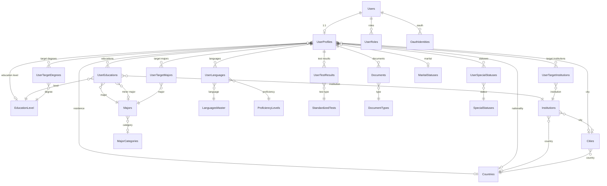
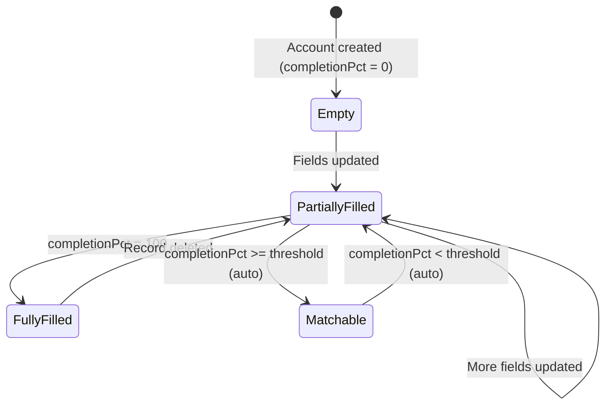
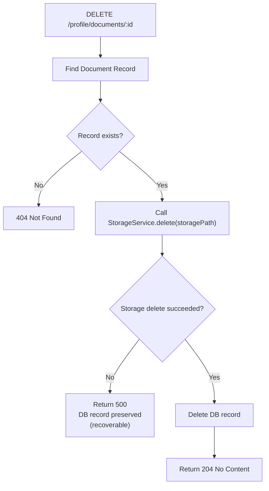

# Data Model: Profile Module v2 Redesign

**Feature**: 005-profile-v2-redesign
**Date**: 2026-09-21
**Schema version**: 2.0 (canonical source: `docx/complete-schema.md`)

---

## Entity Overview

Note: MajorCategories, EducationLevel, MaritalStatuses, SpecialStatuses, StandardizedTests, LanguagesMaster, ProficiencyLevels, and DocumentTypes are fully seeded before Batch 1 tests run. Countries, Cities, Majors, and Institutions are loaded via the reference data loader described in the "Reference Data Loading Strategy" section.

---

## Core Entities

### UserProfiles — Profile Hub

The central table of the profile domain. Primary key is `userId` (same UUID as
`Users.id`) — enforcing strict 1:1 and eliminating a separate surrogate key.

| Column | Type | Nullable | Notes |
|:---|:---|:---:|:---|
| `userId` | UUID PK | No | FK → `Users.id` (cascade delete) |
| `firstName` | VARCHAR(255) | Yes | Profile name — may differ from account name |
| `lastName` | VARCHAR(255) | Yes | |
| `email` | TEXT | Yes | Profile email — may differ from account email |
| `dateOfBirth` | DATE | Yes | |
| `gender` | ENUM (MALE/FEMALE) | Yes | |
| `maritalStatusId` | UUID FK | Yes | → `MaritalStatuses.id` |
| `phone` | TEXT | Yes | |
| `bio` | TEXT | Yes | Max length enforced via SystemSettings |
| `profilePhotoUrl` | TEXT | Yes | URL string only; upload is out of scope |
| `countryOfResidenceId` | UUID FK | Yes | → `Countries.id` (named relation "ProfileResidence") |
| `nationalityId` | UUID FK | Yes | → `Countries.id` (named relation "ProfileNationality") |
| `currentCityId` | UUID FK | Yes | → `Cities.id` |
| `educationLevelId` | UUID FK | Yes | → `EducationLevel.id` (current, not history) |
| `completionPct` | INT | No | 0–100; computed by `recalculate()` |
| `isMatchable` | BOOLEAN | No | System-controlled: `completionPct >= matching.threshold` |
| `matchingVersion` | INT | No | Increments on every `recalculate()` call |
| `createdAt` | TIMESTAMPTZ | No | |
| `updatedAt` | TIMESTAMPTZ | Yes | |

**Indexes**: `isMatchable`, `matchingVersion`

**Validation rules (application layer)**:
- All fields optional on update (DTO `PartialType`)
- `bio` max length from `SystemSettings.MAX_BIO_LENGTH (default 1000)
- `dateOfBirth` → ISO 8601 date string in DTO, stored as `DATE`
- `gender` → strict enum: `MALE` | `FEMALE`
- FKs (`maritalStatusId`, `countryOfResidenceId`, etc.) validated against master tables before write

---

### UserEducations — Education History

Multiple records per user. Each record is a unique institution × major × level combination.

| Column | Type | Nullable | Notes |
|:---|:---|:---:|:---|
| `id` | UUID PK | No | |
| `userId` | UUID FK | No | → `UserProfiles.userId` (cascade delete) |
| `educationLevelId` | UUID FK | No | → `EducationLevel.id` |
| `institutionId` | UUID FK | No | → `Institutions.id` |
| `majorId` | UUID FK | No | → `Majors.id` (named "PrimaryMajor") |
| `minorMajorId` | UUID FK | Yes | → `Majors.id` (named "MinorMajor") |
| `startDate` | DATE | Yes | |
| `endDate` | DATE | Yes | Must be after startDate if both set |
| `expectedGraduationDate` | DATE | Yes | |
| `isCurrent` | BOOLEAN | No | Default false |
| `gpaRaw` | DECIMAL(5,2) | Yes | Original value as entered |
| `gpaScale` | ENUM | Yes | OUT_OF_4 / OUT_OF_5 / OUT_OF_100; required if gpaRaw set |
| `gpaNormalized` | DECIMAL(5,2) | Yes | Always 0–4.0 scale; computed on write |
| `createdAt` | TIMESTAMPTZ | No | |
| `updatedAt` | TIMESTAMPTZ | Yes | |

**Unique constraint**: `(userId, institutionId, majorId, educationLevelId)`

**Limit**: `MAX_EDUCATIONS` from SystemSettings (default 5)

**Validation**: `endDate > startDate` when both provided; `gpaScale` required when `gpaRaw` set

---

### UserLanguages — Language Records

Composite PK: one row per language per user.

| Column | Type | Nullable | Notes |
|:---|:---|:---:|:---|
| `userId` | UUID PK | No | → `UserProfiles.userId` |
| `languageId` | UUID PK | No | → `LanguagesMaster.id` |
| `proficiencyLevelId` | UUID FK | No | → `ProficiencyLevels.id` |
| `isNative` | BOOLEAN | No | Default false |

**Limit**: `MAX_LANGUAGES` (default 10)

---

### UserTestResults — Standardized Test Results

| Column | Type | Nullable | Notes |
|:---|:---|:---:|:---|
| `id` | UUID PK | No | |
| `userId` | UUID FK | No | → `UserProfiles.userId` |
| `testId` | UUID FK | No | → `StandardizedTests.id` |
| `score` | DECIMAL(6,2) | No | Validated at app layer vs min/max/step |
| `testDate` | DATE | Yes | |

**Unique**: `(userId, testId)` — one result per test type per user

**Score validation**: `minScore ≤ score ≤ maxScore` AND `(score - minScore) % scoreStep == 0`

**Limit**: `MAX_TEST_RESULTS` (default 10)

---

### Documents — User Documents

| Column | Type | Nullable | Notes |
|:---|:---|:---:|:---|
| `id` | UUID PK | No | |
| `userId` | UUID FK | No | → `UserProfiles.userId` |
| `documentTypeId` | UUID FK | No | → `DocumentTypes.id` |
| `displayName` | TEXT | No | Human-readable file name |
| `storagePath` | TEXT | No | Storage provider key/path |
| `mimeType` | TEXT | No | Validated against SystemSettings whitelist |
| `sizeBytes` | INT | No | Validated against SystemSettings max |
| `createdAt` | TIMESTAMPTZ | No | |
| `updatedAt` | TIMESTAMPTZ | Yes | |

**No soft-delete**: Hard-delete only, storage-first.

**Upload constraints**: Both `MAX_DOCUMENT_SIZE_BYTES` (default 10 MB) and
`ALLOWED_DOCUMENT_MIME_TYPES` read from SystemSettings with fallback defaults.

---

### Pivot Tables (Many-to-Many)

| Table | PK | FK 1 | FK 2 |
|:---|:---|:---|:---|
| `UserSpecialStatuses` | (userId, specialStatusId) | UserProfiles.userId | SpecialStatuses.id |
| `UserTargetDegrees` | (userId, educationLevelId) | UserProfiles.userId | EducationLevel.id |
| `UserTargetMajors` | (userId, majorId) | UserProfiles.userId | Majors.id |
| `UserTargetInstitutions` | (userId, institutionId) | UserProfiles.userId | Institutions.id |

All cascade-delete when profile is deleted. All have configurable limits from SystemSettings.

---

## Reference / Master Data Entities

All reference entities share the same shape pattern:
- UUID PK (`gen_random_uuid()`)
- `nameEn` / `nameAr` (bilingual)
- `isActive: Boolean @default(true)`
- `sortOrder: Int @default(0)`

| Entity | Table | Notes |
|:---|:---|:---|
| `EducationLevel` | `education_levels` | `code` (unique code), `nameEn`, `nameAr` |
| `MaritalStatuses` | `marital_statuses` | |
| `SpecialStatuses` | `special_statuses` | |
| `StandardizedTests` | `standardized_tests` | + `minScore`, `maxScore`, `scoreStep` |
| `LanguagesMaster` | `languages_master` | + `isoCode` |
| `ProficiencyLevels` | `proficiency_levels` | + `sortOrder` for ordering |
| `DocumentTypes` | `document_types` | |
| `Countries` | `countries` | Hybrid-cached; `isoCode`, `phoneCode`, `flagEmoji` |
| `Cities` | `cities` | FK → Countries |
| `MajorCategories` | `major_categories` | |
| `Majors` | `majors` | Hybrid-cached; FK → MajorCategories |
| `Institutions` | `institutions` | Hybrid-cached; FK → Countries + Cities |

---

## System Configuration

### SystemSettings

| Column | Type | Notes |
|:---|:---|:---|
| `key` | VARCHAR(100) PK | e.g., `"profile.max_educations"` |
| `value` | JSON | Stored as JSON; parsed at runtime |
| `description` | TEXT | Human-readable explanation |
| `updatedAt` | TIMESTAMPTZ | Auto-updated |

**Usage pattern**: `SystemSettingsService.get(key, defaultValue)` — always returns
a value; never throws on missing key.

---

## State Transitions

### Profile Completion Flow

### Document Deletion Flow

---

## Key FK Naming Conventions

| Field in Prisma | DB Column | References |
|:---|:---|:---|
| `userId` on UserProfiles | `user_id` | `users.id` |
| `userId` on sub-tables | `user_id` | `user_profiles.user_id` |
| `educationLevelId` | `education_level_id` | `education_levels.id` |
| `maritalStatusId` | `marital_status_id` | `marital_statuses.id` |
| `countryOfResidenceId` | `country_of_residence_id` | `countries.id` |
| `nationalityId` | `nationality_id` | `countries.id` |
| `currentCityId` | `current_city_id` | `cities.id` |
| `documentTypeId` | `document_type_id` | `document_types.id` |
| `proficiencyLevelId` | `proficiency_level_id` | `proficiency_levels.id` |
| `specialStatusId` | `special_status_id` | `special_statuses.id` |

All snake_case in DB, camelCase in TypeScript via `@map()`.
